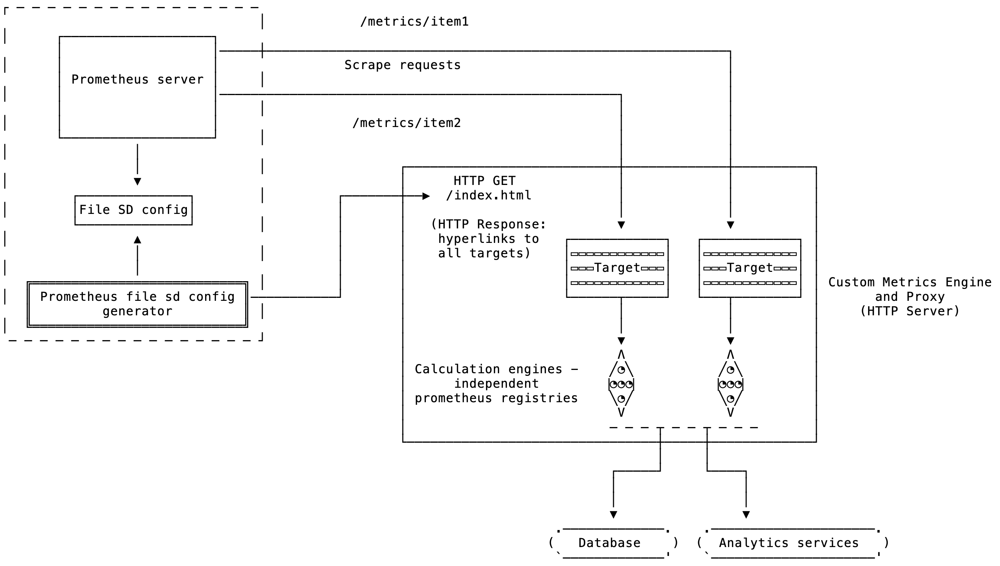

# Prometheus File SD config generator

[](https://travis-ci.org/amitsaha/prom-file-sd-config-generator)

This is a utility program which will generate a file SD config (in JSON) for Prometheus
given a target HTTP URL which has a list of the different targets to scrape.

## Background

If your infrastructure has a large number of targets which you cannot specify via one
of the prometheus service discovery mechanisms, you need to resort to specifying each
target in the `prometheus` configuration file. However, manually editing the config file
for every new target is a chore especially when you have a growing number of such targets.
A simple approach in this case without making any other assumptions about your
infrastructure is to use the file based target discovery 
mechanism. Your prometheus configuration file doesn't need to be updated for adding a new
target this way. 

Continuing with our assumption that we have a large number of such targets, we further
want a simple mechanism to update the file containing these targets. To this end, why not 
have a centralized list of these targets and then generate the file SD config from this? 
Once you have the list centralized, you can add any new target to it and this generator 
program will automatically generate a new file SD config with any new targets.

This project aims to be this generator - when you give it a HTTP URL containing a list of these
targets as hyperlinks, it will parse them and generate the file SD config. Let's consider an example.

Given a HTTP server which serves the following HTML:

```
<a href="http://127.0.0.1:9100/metrics/testitem1">target1</a>
<a href="http://127.0.0.1:9200/metrics/testitem2">target2</a>
<a href="http://127.0.0.1:9300/metrics/testitem3">target3</a>
```

`prom-file-sd-config-generator` will create a file containing the targets as follows:

```
[
  {
    "targets": ["127.0.0.1:21500"],
    "labels": {
      "__metrics_path__": "/metrics/testitem1"
    }
  },
  {
    "targets": ["127.0.0.1:21500"],
    "labels": {
      "__metrics_path__": "/metrics/testitem2"
    }
  },
  {
    "targets": ["127.0.0.1:21500"],
    "labels": {
      "__metrics_path__": "/metrics/testitem3"
    }
  }
]

```

The `prometheus` config will be as follows:

```
global:
  scrape_interval:     15s
  evaluation_interval: 15s 
scrape_configs: 
....
  - job_name: 'test'
    file_sd_configs:
      - files:
        - sample_generated_targets.json
....
```

A scenario which motivated this utility is depicted below:



The custom metrics engine acts as the target registry as well as having a metrics engine
which calculates custom metrics and then exports them as prometheus metrics using a language
specific prometheus client.

## Usage

The program has three options (two of them optional):

```
$ prom-file-sd-config 
Usage of ./prom-file-sd-config:
  -config-path string
    	Path of the SD config JSON file (default "./file_sd_config.json")
  -scrape-interval int
    	Interval in seconds between consecutive scrapes (default 5)
  -target-source string
    	HTTP URL of the target source
```

The only required argument is the `target-source` which is the HTTP resource which acts
as the centralized repository of the targets. An example of such a page is:

```
<a href="http://127.0.0.1:9100/bar1/metrics">target1</a>
<a href="http://127.0.0.1:9100/bar2/metrics">target2</a>
<a href="http://127.0.0.1:9100/bar3">target3</a>
```

The generated file SD config will be:

```
[
  {
    "targets": ["127.0.0.1:9100"],
    "labels": {
      "__metrics_path__": "/bar1/metrics"
    }
  },
  {
    "targets": ["127.0.0.1:9100"],
    "labels": {
      "__metrics_path__": "/bar2/metrics
    }
  },
  {
    "targets": ["127.0.0.1:9100"],
    "labels": {
      "__metrics_path__": "/bar3"
    }
  }
]

```

## Development

```
$ go test -v
```

## Deployment

A docker image is available on [docker hub](https://hub.docker.com/r/amitsaha/prom-file-sd-config-generator).
You can use the `Dockerfile` to build one yourself. The `ENTRYPOINT` is set to the binary, so you only
need to specify the options above.

In a VM world, you could deploy it alongside your prometheus server as a separate container or
use a systemd service to run the binary.

In a kubernetes world, you could run this in the same pod as your prometheus server so that they have a common
volume, or of course, you could deploy it as it's own pod with a shared volume with the prometheus server.
Write permissions are needed.

## LICENSE

Apache 2.0 (See [LICENSE](./LICENSE))
